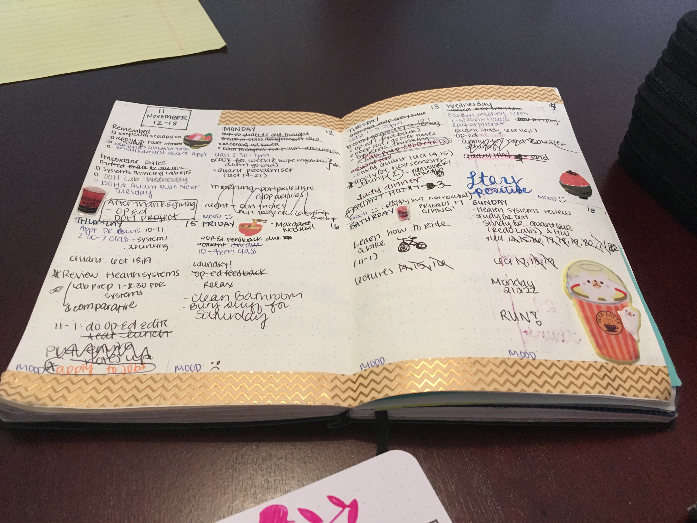
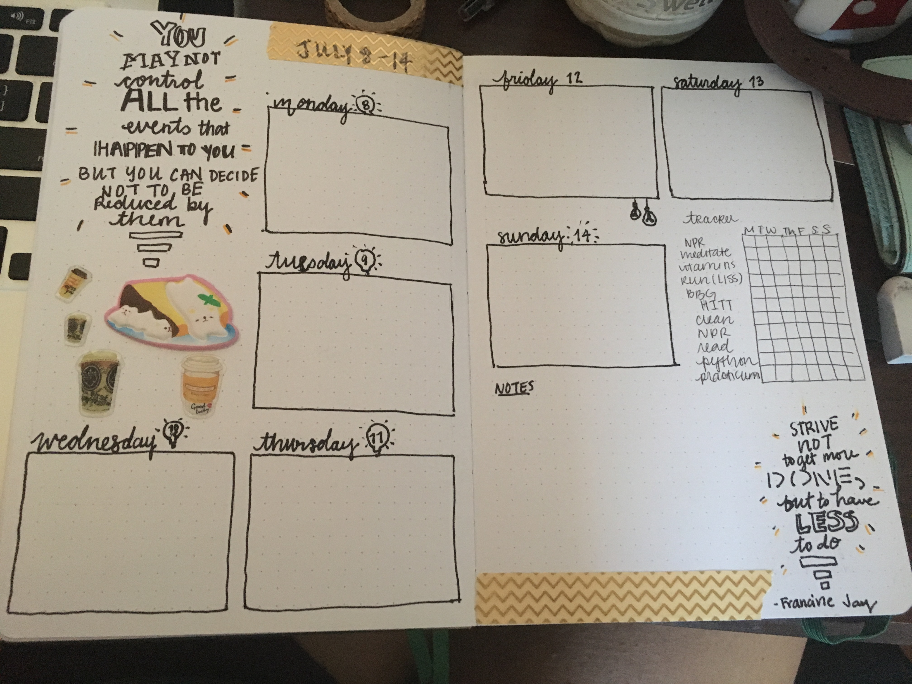
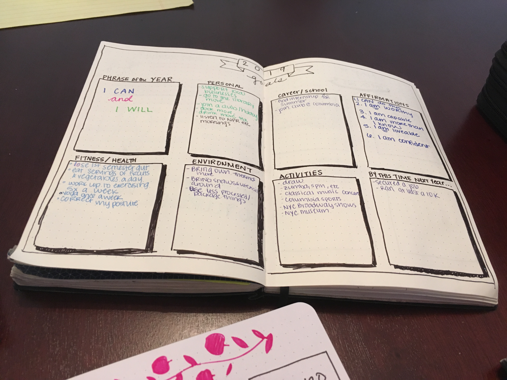

## Current Academic Standing 
I am a second year Master of Public Health student at Columbia University's Mailman School of Public Health in the department. 

## What do I do during my free time 

In my free time I like to do the following:

### Run

My goal for 2019 was to run the Brooklyn Half-- however I got hamstring tendonitis so now I'm building up again. Will continue to strive for more 5Ks and other races in the future.  Here's a crooked photo of me

### Read Books 

I absolutely love reading. My 2019 Goodreads goal is to read 20 books. So far I have read 17 books as of October 29, 2019. 

My favorite book so far is Nightgale by Kristin Hannah. 

 

You can access my goodreads profile [here](https://www.goodreads.com/user/show/85707539-kelly)

### Bullet Journaling

I am a very crafty person and thoroughly enjoy bullet journaling. HEre are some of my spreads that I'm quite content with.

